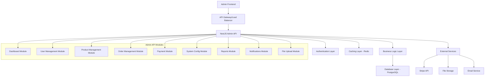
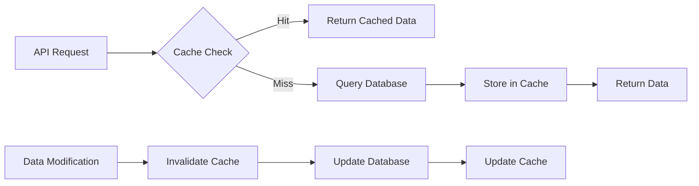

# Design Document

## Overview

This design document outlines the implementation of a comprehensive admin API system for the marketplace platform with integrated Redis caching. The system will provide full administrative capabilities across all major platform functions while ensuring optimal performance through intelligent caching strategies.

The design follows NestJS best practices with modular architecture, proper separation of concerns, and comprehensive error handling. The caching layer will be implemented using Redis with configurable TTL values and intelligent cache invalidation strategies.

## Architecture

### High-Level Architecture



### Caching Strategy Architecture



## Components and Interfaces

### 1. Core Infrastructure Components

#### 1.1 Cache Service
```typescript
interface ICacheService {
  get<T>(key: string): Promise<T | null>;
  set<T>(key: string, value: T, ttl?: number): Promise<void>;
  del(key: string): Promise<void>;
  delPattern(pattern: string): Promise<void>;
  exists(key: string): Promise<boolean>;
  ttl(key: string): Promise<number>;
}
```

#### 1.2 Cache Key Generator
```typescript
interface ICacheKeyGenerator {
  generateKey(prefix: string, params: Record<string, any>): string;
  generatePatternKey(prefix: string, pattern: string): string;
}
```

#### 1.3 Cache Decorator
```typescript
interface CacheOptions {
  ttl?: number;
  keyGenerator?: (args: any[]) => string;
  condition?: (args: any[]) => boolean;
}

@Cache(options: CacheOptions)
```

### 2. Admin Module Components

#### 2.1 Dashboard Service Interface
```typescript
interface IDashboardService {
  getDashboardMetrics(dateFrom?: Date, dateTo?: Date): Promise<DashboardMetricsDto>;
  getSalesAnalytics(dateFrom: Date, dateTo: Date, interval?: string): Promise<SalesAnalyticsDto>;
}
```

#### 2.2 User Management Service Interface
```typescript
interface IUserManagementService {
  getUsers(query: GetUsersQueryDto): Promise<PaginatedUsersDto>;
  getUserDetails(id: string): Promise<UserDetailsDto>;
  updateUserStatus(id: string, status: UserStatus): Promise<void>;
  getUserAnalytics(dateFrom?: Date, dateTo?: Date): Promise<UserAnalyticsDto>;
}
```

#### 2.3 Product Management Service Interface
```typescript
interface IProductManagementService {
  getProducts(query: GetProductsQueryDto): Promise<PaginatedProductsDto>;
  getProductDetails(id: string): Promise<ProductDetailsDto>;
  createProduct(data: CreateProductDto): Promise<ProductDto>;
  updateProduct(id: string, data: UpdateProductDto): Promise<ProductDto>;
  deleteProduct(id: string): Promise<void>;
  getProductAnalytics(dateFrom?: Date, dateTo?: Date): Promise<ProductAnalyticsDto>;
  updateInventory(id: string, data: UpdateInventoryDto): Promise<void>;
  bulkAction(data: BulkProductActionDto): Promise<void>;
  exportProducts(data: ExportProductsDto): Promise<ExportResultDto>;
}
```

#### 2.4 Order Management Service Interface
```typescript
interface IOrderManagementService {
  getOrders(query: GetOrdersQueryDto): Promise<PaginatedOrdersDto>;
  getOrderDetails(id: string): Promise<OrderDetailsDto>;
  updateOrderStatus(id: string, data: UpdateOrderStatusDto): Promise<void>;
  processRefund(id: string, data: ProcessRefundDto): Promise<void>;
  getOrderAnalytics(dateFrom: Date, dateTo: Date): Promise<OrderAnalyticsDto>;
  exportOrders(data: ExportOrdersDto): Promise<ExportResultDto>;
}
```

### 3. Data Transfer Objects (DTOs)

#### 3.1 Dashboard DTOs
```typescript
class DashboardMetricsDto {
  total_users: number;
  total_products: number;
  total_orders: number;
  total_revenue: number;
  user_growth: number;
  order_growth: number;
  revenue_growth: number;
  active_users: number;
  pending_orders: number;
  low_stock_products: number;
}

class SalesAnalyticsDto {
  sales_trend: SalesTrendItem[];
  total_revenue: number;
  total_orders: number;
  growth_rate: number;
}
```

#### 3.2 Query DTOs
```typescript
class GetUsersQueryDto {
  @IsOptional()
  @IsInt()
  @Min(1)
  page?: number = 1;

  @IsOptional()
  @IsInt()
  @Min(1)
  @Max(100)
  limit?: number = 10;

  @IsOptional()
  @IsString()
  search?: string;

  @IsOptional()
  @IsEnum(UserRole)
  role?: UserRole;

  @IsOptional()
  @IsEnum(UserStatus)
  status?: UserStatus;

  @IsOptional()
  @IsDateString()
  date_from?: string;

  @IsOptional()
  @IsDateString()
  date_to?: string;

  @IsOptional()
  @IsEnum(['name', 'email', 'created_at'])
  sort_by?: string = 'created_at';

  @IsOptional()
  @IsEnum(['asc', 'desc'])
  sort_order?: string = 'desc';
}
```

### 4. Cache Configuration

#### 4.1 Cache TTL Configuration
```typescript
export const CACHE_TTL = {
  DASHBOARD_METRICS: 5 * 60, // 5 minutes
  SALES_ANALYTICS: 10 * 60, // 10 minutes
  USER_LIST: 10 * 60, // 10 minutes
  USER_DETAILS: 15 * 60, // 15 minutes
  PRODUCT_LIST: 15 * 60, // 15 minutes
  PRODUCT_DETAILS: 30 * 60, // 30 minutes
  CATEGORY_TREE: 30 * 60, // 30 minutes
  ORDER_LIST: 5 * 60, // 5 minutes
  ORDER_ANALYTICS: 10 * 60, // 10 minutes
  SYSTEM_SETTINGS: 60 * 60, // 1 hour
  NOTIFICATIONS: 5 * 60, // 5 minutes
} as const;
```

#### 4.2 Cache Key Patterns
```typescript
export const CACHE_KEYS = {
  DASHBOARD_METRICS: 'admin:dashboard:metrics',
  SALES_ANALYTICS: 'admin:sales:analytics',
  USER_LIST: 'admin:users:list',
  USER_DETAILS: 'admin:users:details',
  PRODUCT_LIST: 'admin:products:list',
  PRODUCT_DETAILS: 'admin:products:details',
  CATEGORY_TREE: 'admin:categories:tree',
  ORDER_LIST: 'admin:orders:list',
  ORDER_ANALYTICS: 'admin:orders:analytics',
  SYSTEM_SETTINGS: 'admin:settings',
  NOTIFICATIONS: 'admin:notifications',
} as const;
```

## Data Models

### 1. Enhanced Entity Models

#### 1.1 User Entity Extensions
```typescript
@Entity('users')
export class User {
  // ... existing fields ...
  
  @Column({ type: 'timestamp', default: () => 'CURRENT_TIMESTAMP' })
  last_login_at: Date;
  
  @Column({ type: 'boolean', default: true })
  is_active: boolean;
  
  @Column({ type: 'jsonb', nullable: true })
  metadata: Record<string, any>;
  
  // Virtual fields for admin analytics
  @VirtualColumn({
    query: (alias) => 
      `SELECT COUNT(*) FROM orders WHERE orders.user_id = ${alias}.id`
  })
  order_count: number;
  
  @VirtualColumn({
    query: (alias) => 
      `SELECT COALESCE(SUM(total), 0) FROM orders WHERE orders.user_id = ${alias}.id AND status = 'delivered'`
  })
  total_spent: number;
}
```

#### 1.2 Product Entity Extensions
```typescript
@Entity('products')
export class Product {
  // ... existing fields ...
  
  @Column({ type: 'varchar', unique: true })
  sku: string;
  
  @Column({ type: 'decimal', precision: 10, scale: 2, nullable: true })
  weight: number;
  
  @Column({ type: 'jsonb', nullable: true })
  dimensions: {
    length: number;
    width: number;
    height: number;
  };
  
  @Column({ type: 'enum', enum: ['active', 'inactive', 'draft'], default: 'active' })
  status: string;
  
  @Column({ type: 'boolean', default: false })
  featured: boolean;
  
  @Column({ type: 'text', array: true, default: [] })
  tags: string[];
  
  @Column({ type: 'varchar', nullable: true })
  meta_title: string;
  
  @Column({ type: 'text', nullable: true })
  meta_description: string;
  
  @Column({ type: 'int', default: 0 })
  minimum_stock: number;
  
  @Column({ type: 'int', default: 0 })
  sales_count: number;
}
```

#### 1.3 Order Entity Extensions
```typescript
@Entity('orders')
export class Order {
  // ... existing fields ...
  
  @Column({ type: 'varchar', nullable: true })
  payment_method: string;
  
  @Column({ type: 'jsonb', nullable: true })
  payment_method_details: Record<string, any>;
  
  @Column({ type: 'decimal', precision: 10, scale: 2, default: 0 })
  fees: number;
  
  @Column({ type: 'decimal', precision: 10, scale: 2, default: 0 })
  net_amount: number;
  
  @Column({ type: 'text', nullable: true })
  admin_notes: string;
  
  @Column({ type: 'jsonb', nullable: true })
  shipping_details: Record<string, any>;
}
```

### 2. New Entity Models

#### 2.1 System Settings Entity
```typescript
@Entity('system_settings')
export class SystemSettings {
  @PrimaryGeneratedColumn('uuid')
  id: string;
  
  @Column({ type: 'varchar', unique: true })
  key: string;
  
  @Column({ type: 'jsonb' })
  value: any;
  
  @Column({ type: 'varchar', nullable: true })
  description: string;
  
  @Column({ type: 'enum', enum: ['string', 'number', 'boolean', 'object'], default: 'string' })
  type: string;
  
  @CreateDateColumn()
  created_at: Date;
  
  @UpdateDateColumn()
  updated_at: Date;
}
```

#### 2.2 Coupon Entity
```typescript
@Entity('coupons')
export class Coupon {
  @PrimaryGeneratedColumn('uuid')
  id: string;
  
  @Column({ type: 'varchar', unique: true })
  code: string;
  
  @Column({ type: 'enum', enum: ['percentage', 'fixed'], default: 'percentage' })
  type: string;
  
  @Column({ type: 'decimal', precision: 10, scale: 2 })
  value: number;
  
  @Column({ type: 'decimal', precision: 10, scale: 2, nullable: true })
  minimum_amount: number;
  
  @Column({ type: 'decimal', precision: 10, scale: 2, nullable: true })
  maximum_discount: number;
  
  @Column({ type: 'int', nullable: true })
  usage_limit: number;
  
  @Column({ type: 'int', default: 0 })
  used_count: number;
  
  @Column({ type: 'timestamp', nullable: true })
  expires_at: Date;
  
  @Column({ type: 'boolean', default: true })
  is_active: boolean;
  
  @CreateDateColumn()
  created_at: Date;
  
  @UpdateDateColumn()
  updated_at: Date;
}
```

#### 2.3 Admin Notification Entity
```typescript
@Entity('admin_notifications')
export class AdminNotification {
  @PrimaryGeneratedColumn('uuid')
  id: string;
  
  @Column({ type: 'varchar' })
  type: string;
  
  @Column({ type: 'varchar' })
  title: string;
  
  @Column({ type: 'text' })
  message: string;
  
  @Column({ type: 'jsonb', nullable: true })
  data: Record<string, any>;
  
  @Column({ type: 'boolean', default: false })
  read: boolean;
  
  @Column({ type: 'enum', enum: ['info', 'warning', 'error', 'success'], default: 'info' })
  severity: string;
  
  @CreateDateColumn()
  created_at: Date;
}
```

#### 2.4 File Upload Entity
```typescript
@Entity('file_uploads')
export class FileUpload {
  @PrimaryGeneratedColumn('uuid')
  id: string;
  
  @Column({ type: 'varchar' })
  filename: string;
  
  @Column({ type: 'varchar' })
  original_name: string;
  
  @Column({ type: 'varchar' })
  url: string;
  
  @Column({ type: 'varchar' })
  mime_type: string;
  
  @Column({ type: 'int' })
  size: number;
  
  @Column({ type: 'enum', enum: ['product', 'category', 'general'], default: 'general' })
  type: string;
  
  @Column({ type: 'uuid', nullable: true })
  uploaded_by: string;
  
  @CreateDateColumn()
  created_at: Date;
}
```

## Error Handling

### 1. Custom Exception Classes

```typescript
export class AdminException extends HttpException {
  constructor(
    message: string,
    statusCode: HttpStatus,
    errorCode?: string,
    details?: any[]
  ) {
    super(
      {
        error: {
          code: errorCode || 'ADMIN_ERROR',
          message,
          details: details || [],
        },
        timestamp: new Date().toISOString(),
      },
      statusCode
    );
  }
}

export class CacheException extends AdminException {
  constructor(message: string, details?: any[]) {
    super(message, HttpStatus.INTERNAL_SERVER_ERROR, 'CACHE_ERROR', details);
  }
}

export class ValidationException extends AdminException {
  constructor(message: string, details: any[]) {
    super(message, HttpStatus.BAD_REQUEST, 'VALIDATION_ERROR', details);
  }
}
```

### 2. Global Exception Filter Enhancement

```typescript
@Catch()
export class AdminExceptionFilter implements ExceptionFilter {
  private readonly logger = new Logger(AdminExceptionFilter.name);

  catch(exception: unknown, host: ArgumentsHost) {
    const ctx = host.switchToHttp();
    const response = ctx.getResponse<Response>();
    const request = ctx.getRequest<Request>();

    let status = HttpStatus.INTERNAL_SERVER_ERROR;
    let errorResponse: any = {
      error: {
        code: 'INTERNAL_ERROR',
        message: 'Internal server error',
        details: [],
      },
      timestamp: new Date().toISOString(),
      path: request.url,
    };

    if (exception instanceof AdminException) {
      status = exception.getStatus();
      errorResponse = {
        ...exception.getResponse(),
        path: request.url,
      };
    } else if (exception instanceof HttpException) {
      status = exception.getStatus();
      const exceptionResponse = exception.getResponse();
      
      if (typeof exceptionResponse === 'object') {
        errorResponse = {
          ...errorResponse,
          ...exceptionResponse,
        };
      } else {
        errorResponse.error.message = exceptionResponse;
      }
    }

    this.logger.error(
      `Admin API Error: ${errorResponse.error.message}`,
      exception instanceof Error ? exception.stack : exception
    );

    response.status(status).json(errorResponse);
  }
}
```

## Testing Strategy

### 1. Unit Testing Strategy

#### 1.1 Service Layer Testing
- Test all business logic methods
- Mock external dependencies (database, cache, external APIs)
- Test error scenarios and edge cases
- Verify cache operations and invalidation logic

#### 1.2 Cache Service Testing
```typescript
describe('CacheService', () => {
  let service: CacheService;
  let redisClient: jest.Mocked<Redis>;

  beforeEach(async () => {
    const module = await Test.createTestingModule({
      providers: [
        CacheService,
        {
          provide: 'REDIS_CLIENT',
          useValue: createMockRedis(),
        },
      ],
    }).compile();

    service = module.get<CacheService>(CacheService);
    redisClient = module.get('REDIS_CLIENT');
  });

  it('should cache and retrieve data', async () => {
    const key = 'test:key';
    const value = { data: 'test' };
    
    await service.set(key, value, 300);
    const result = await service.get(key);
    
    expect(result).toEqual(value);
    expect(redisClient.setex).toHaveBeenCalledWith(key, 300, JSON.stringify(value));
  });
});
```

### 2. Integration Testing Strategy

#### 2.1 API Endpoint Testing
```typescript
describe('Admin Dashboard (e2e)', () => {
  let app: INestApplication;
  let adminToken: string;

  beforeEach(async () => {
    const moduleFixture = await Test.createTestingModule({
      imports: [AppModule],
    }).compile();

    app = moduleFixture.createNestApplication();
    await app.init();
    
    adminToken = await getAdminToken(app);
  });

  it('/api/admin/dashboard/metrics (GET)', () => {
    return request(app.getHttpServer())
      .get('/api/admin/dashboard/metrics')
      .set('Authorization', `Bearer ${adminToken}`)
      .expect(200)
      .expect((res) => {
        expect(res.body).toHaveProperty('total_users');
        expect(res.body).toHaveProperty('total_products');
        expect(res.body).toHaveProperty('total_orders');
      });
  });
});
```

### 3. Performance Testing Strategy

#### 3.1 Cache Performance Testing
- Test cache hit/miss ratios
- Measure response time improvements with caching
- Test cache invalidation performance
- Load testing with concurrent requests

#### 3.2 Database Query Optimization Testing
- Test complex analytics queries performance
- Verify proper indexing usage
- Test pagination performance with large datasets

## Implementation Phases

### Phase 1: Core Infrastructure
1. Set up Redis caching infrastructure
2. Implement cache service and decorators
3. Create base admin module structure
4. Implement authentication and authorization guards

### Phase 2: Dashboard & Analytics
1. Implement dashboard metrics endpoints
2. Create sales analytics functionality
3. Add caching for dashboard data
4. Implement real-time data updates

### Phase 3: User & Product Management
1. Implement user management endpoints
2. Create product management functionality
3. Add category management
4. Implement bulk operations and exports

### Phase 4: Order & Payment Management
1. Implement order management endpoints
2. Create payment transaction management
3. Add refund processing functionality
4. Implement order analytics

### Phase 5: System Configuration & Reports
1. Implement system settings management
2. Create coupon management functionality
3. Add custom report generation
4. Implement file upload management

### Phase 6: Notifications & Monitoring
1. Implement notification system
2. Create system alerts functionality
3. Add performance monitoring
4. Implement audit logging

This design provides a comprehensive foundation for implementing all admin API endpoints with integrated caching, ensuring optimal performance, maintainability, and scalability.